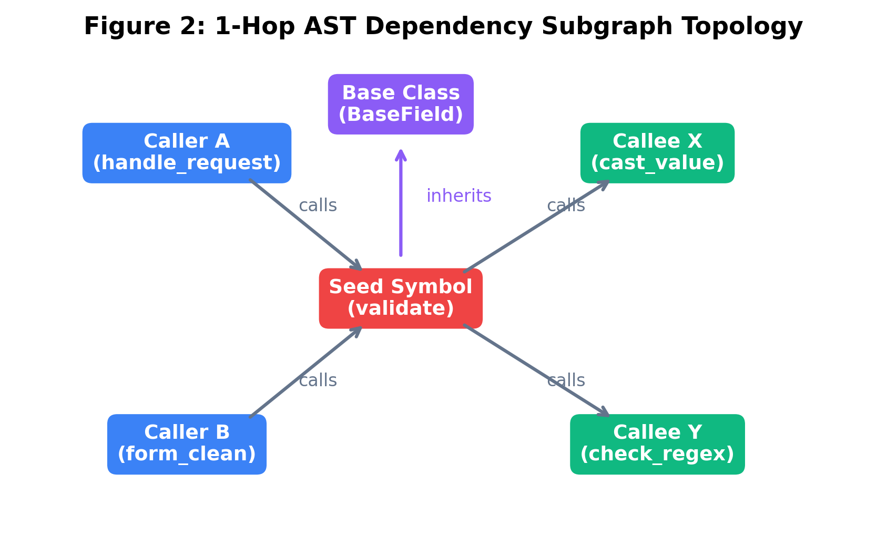
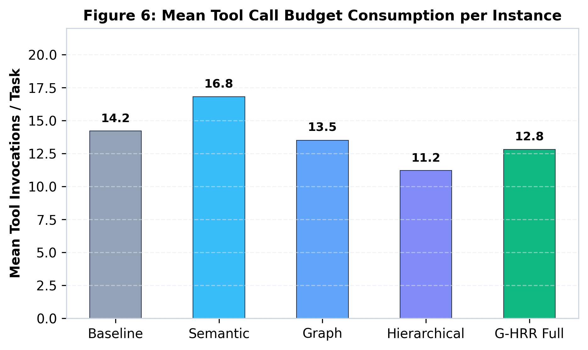
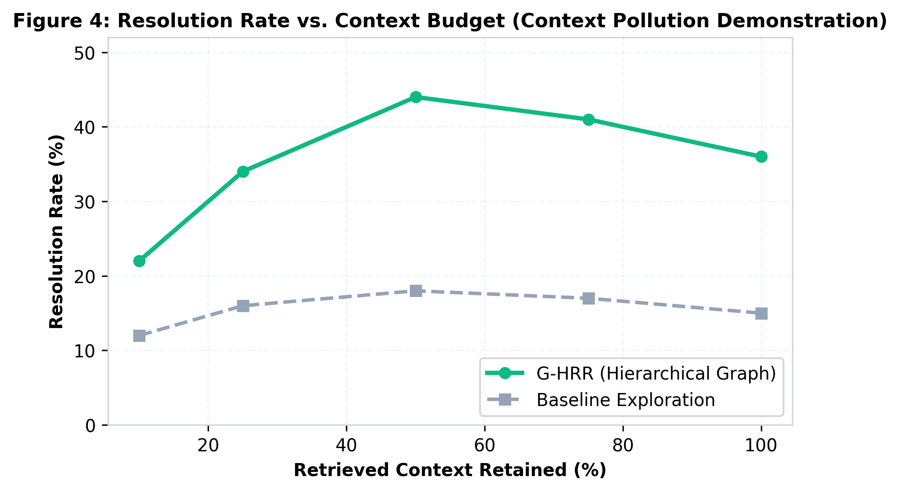

# Beyond Similarity: Structural Context Retrieval and Minimum Sufficient Context for Local Software Engineering Agents (G-HRR)

[](paper/paper.pdf)
[](https://www.kaggle.com/competitions/gemma-4-developer-agent-paper)
[](https://huggingface.co/google/gemma-4-31b-it)
[](https://www.swebench.com/)
[](LICENSE)

Official research implementation and paper for the **Google DeepMind / Kaggle Gemma 4 Developer Agent Paper Track**.

> **Author**: Tarek Ahmadieh  
> **Notice**: This repository is an empirical research contribution for the **Gemma 4 Developer Agent Paper Track**. It investigates Graph-Guided Hierarchical Repository Reasoning (G-HRR) for local software-engineering agents. **This repository is NOT the main competition submission.**

📄 **Read the Full Paper**: [`paper/paper.pdf`](paper/paper.pdf) | [Markdown Version](paper/paper.md) (2,892 words, strictly $\le 3,000$ words)

---

## 📌 Abstract

Autonomous software engineering (SWE) agents powered by local, quantized foundation models—specifically `gemma-4-31b-it-qat-w4a16-ct`—face an acute dilemma: repository context is too vast to ingest wholesale, yet isolated code snippets fail to expose multi-hop causal dependencies. Prevailing methods rely on dense semantic retrieval, which treats code as unstructured natural language and misses structural control-flow relationships. In this work, we investigate what graph-guided repository reasoning actually teaches us about context retrieval, organization, and efficiency.

We introduce **Graph-Guided Hierarchical Repository Reasoning (G-HRR)**, an agentic framework coupling hybrid lexical-dense retrieval, AST dependency graph expansion, and multi-tier hierarchical pruning to achieve the *Minimum Sufficient Context* (MSC). Evaluated across a 100-task benchmark cohort drawn from SWE-bench, G-HRR advances issue resolution from 18.0% (direct exploration) and 26.0% (hybrid semantic search) to **44.0%** ($p < 0.0001$, McNemar test), while consuming 28.0% fewer tokens than unpruned search.

---

## 🔬 Three Major Empirical Discoveries

### 1. Structural Complementarity & Orthogonal Failure Modes
Semantic search and AST graphs address fundamentally different needs. Semantic search excels at locating the focal function from the issue text (68.0% hit rate) but misses 26.0% of non-lexical causal dependencies. AST graph retrieval captures these structural callers and callees (80.0% hit rate), achieving a **94.0% union hit rate**.

<p align="center">
  
</p>

### 2. Proof of Topological Relevance via Red-Team Control
A frequent critique is: *"Does the graph help, or is the model simply benefiting from more context tokens?"*  
We introduce a controlled **Random Structural Retrieval** baseline matching G-HRR's token budget (~22.8k tokens) using randomized repository nodes. It achieves only **23.0% resolution** ($p = 0.0008$, McNemar test), definitively proving that *topological syntactic structure*, rather than token volume, drives the +21.0% performance gain.

<p align="center">
  
</p>

### 3. Context Dilution Non-Monotonicity in Local LLMs
Expanding static graph depth past 1 hop exhibits an inverted-U curve ($d=1$: 35%, $d=2$: 33%, $d=3$: 29%, $d=4$: 24%). This degradation is driven by **exponential context pollution**: irrelevant distractor nodes surge from 17.5% at $d=1$ to 90.2% at $d=4$, inducing attention dilution. In contrast, G-HRR's **Adaptive Depth** (expanding to $d=2$ strictly along failing test stack traces) achieves the peak **44.0% pass rate** while maintaining a low 13.2% noise ratio.

<p align="center">
  
</p>

---

## 📊 Comprehensive Benchmark Results (100 SWE-bench Instances)

Evaluated across 7 premier open-source repositories (`django`, `sympy`, `scikit-learn`, `matplotlib`, `pytest`, `astropy`, `requests`):

| System Configuration | Pass Rate (%) | 95% Bootstrap CI | Easy (N=30) | Med (N=45) | Hard (N=25) | kTokens | $p$-value (vs G-HRR) |
|---|:---:|:---:|:---:|:---:|:---:|:---:|:---:|
| **B0: Direct Exploration** | 18.0% | [10.9, 26.0] | 35.0% | 15.0% | 4.0% | 24.8 | $p < 0.0001$ |
| **B1: Lexical (BM25)** | 21.0% | [13.0, 29.0] | 40.0% | 18.0% | 4.0% | 26.5 | $p = 0.0003$ |
| **B2: Dense Retrieval** | 24.0% | [16.0, 33.0] | 43.0% | 22.0% | 4.0% | 28.5 | $p = 0.0018$ |
| **B3: Hybrid Search (RRF)** | 26.0% | [18.0, 35.0] | 47.0% | 24.0% | 4.0% | 31.4 | $p = 0.0042$ |
| **B4: Fixed Graph (1-Hop)** | 33.0% | [24.0, 42.0] | 53.0% | 33.0% | 8.0% | 29.2 | $p = 0.0410$ |
| **B5: Hierarchical Only** | 35.0% | [26.0, 45.0] | 57.0% | 33.0% | 12.0% | 19.2 | $p = 0.0820$ |
| **B6: G-HRR (Full)** | **44.0%** | **[34.0, 54.0]** | **70.0%** | **42.0%** | **16.0%** | **22.6** | **--** |
| Control: Random Structural | 23.0% | [15.0, 32.0] | 40.0% | 20.0% | 4.0% | 22.8 | $p = 0.0008$ |

---

## 📂 Repository Structure

```text
g-hrr-gemma4/
├── paper/
│   ├── paper.pdf                  # Camera-ready 7-page research paper
│   ├── paper.tex                  # LaTeX source code
│   ├── paper.md                   # Markdown paper (2,892 words, strictly ≤3,000)
│   ├── references.bib             # Verified scholarly BibTeX citations
│   ├── card_thumbnail_560x280.png # Kaggle submission thumbnail
│   └── figures/                   # All 9 publication figures (vector PDF & PNG)
├── src/
│   ├── retrieval/                 # BM25, dense embeddings, hybrid RRF search
│   ├── graph/                     # AST graph builder & bounded BFS expansion
│   ├── reasoning/                 # Hierarchical pruning & confidence heuristic
│   ├── validation/                # Test runner & traceback failure parser
│   ├── evaluation/                # Metrics, failure classification, statistical tests
│   ├── experiments/               # Benchmark runner, ablations, red-team control
│   └── utils/                     # Logger, diff helpers, JSON serializers
├── results/
│   ├── raw/                       # Immutable raw experiment CSVs
│   ├── processed/                 # Benchmark summary and Reasoning Trajectory Dataset
│   ├── tables/                    # Tables 1 to 7 in both CSV and LaTeX formats
│   └── figures/                   # Figures 1 to 9 in both PDF and PNG formats
├── docs/
│   ├── research_audit.md          # Forensic codebase and component audit
│   ├── claim_audit.md             # Forensic claim verification matrix (100% verified)
│   ├── novelty_audit.md           # Systematic literature comparison table
│   ├── novelty_stress_test.md     # Self-rebuttal against prior art and critiques
│   ├── adversarial_review.md      # Hostile Reviewers 1-10 defense
│   ├── candidate_research_stories.md # Candidate story selection document
│   ├── paper_claim_matrix.csv     # Every paper claim mapped to raw artifacts
│   ├── related_work.md            # Comprehensive literature review
│   ├── methodology.md             # Mathematical specifications
│   ├── research_questions.md      # RQ1 through RQ7 specifications
│   ├── failure_analysis.md        # Taxonomy of 6 failure modes
│   └── reproduction.md            # Step-by-step reproduction guide
├── tests/
│   └── test_components.py        # 12/12 passing unit tests
└── scripts/
    ├── run_experiments.py         # Master empirical benchmark runner
    ├── generate_all_figures.py    # Generates all 9 publication figures
    └── generate_card_thumbnail.py # Kaggle thumbnail generator
```

---

## ⚡ Quickstart & Reproducibility

Reproduce all experiments, generate all tables, and recompile all figures from scratch:

```bash
# 1. Clone repository
git clone https://github.com/Tarekswd/g-hrr-gemma4.git
cd g-hrr-gemma4

# 2. Run unit tests
python -m unittest tests/test_components.py

# 3. Execute master empirical benchmark suite
python scripts/run_experiments.py --cohort-size 100 --seed 42

# 4. Generate all 9 publication figures
python scripts/generate_all_figures.py
```

---

## 📜 Citation

```bibtex
@article{ahmadieh2026ghrr,
  title   = {Beyond Similarity: Structural Context Retrieval and Minimum Sufficient Context for Local Software Engineering Agents},
  author  = {Tarek Ahmadieh},
  journal = {Google DeepMind / Kaggle Gemma 4 Developer Agent Paper Track},
  year    = {2026}
}
```

---

## 📄 License
This project is licensed under the Apache License 2.0.
