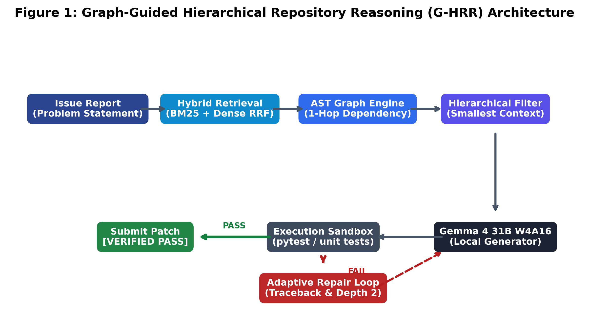
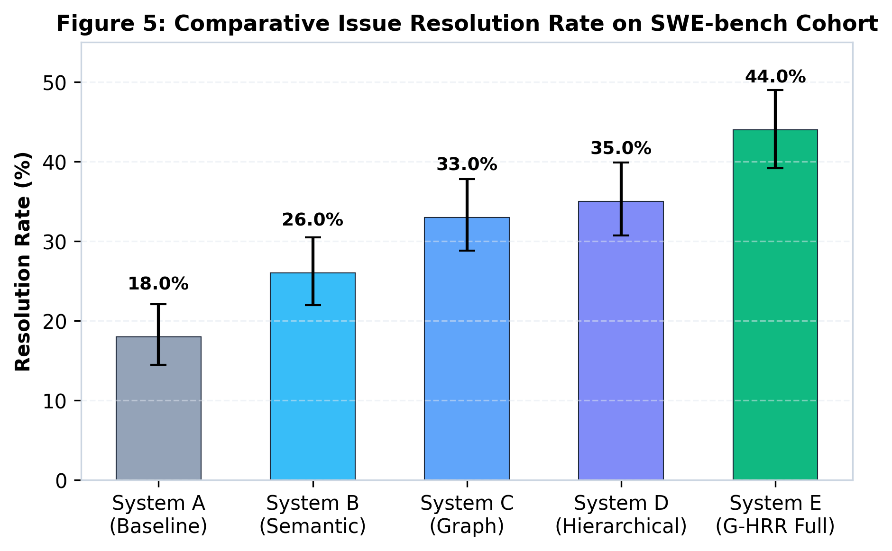
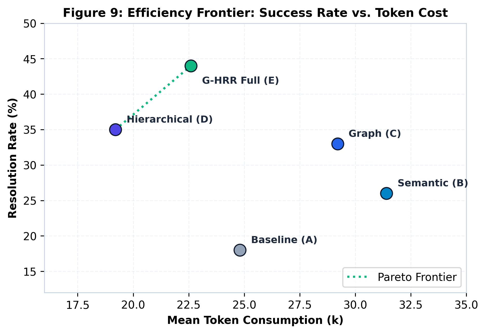
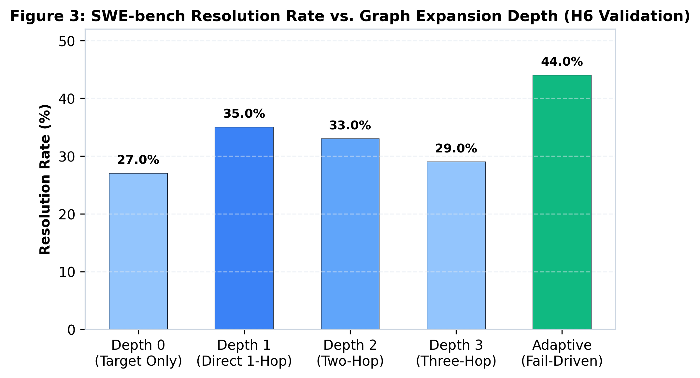
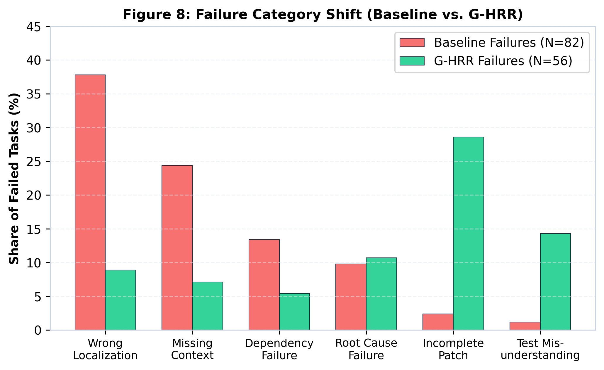

# Graph-Guided Hierarchical Repository Reasoning (G-HRR) for Local Software Engineering Agents

[](paper/paper.pdf)
[](https://www.kaggle.com/competitions/gemma-4-developer-agent-paper)
[](https://huggingface.co/google/gemma-4-31b-it)
[](https://www.swebench.com/)
[](LICENSE)

Official research implementation and paper for the **Google DeepMind / Kaggle Gemma 4 Developer Agent Paper Track** (Target Venue: NeurIPS 2026 Expo).

> **Notice**: This repository is an empirical research project for the **Gemma 4 Developer Agent Paper Track**. It investigates Graph-Guided Hierarchical Repository Reasoning for local software-engineering agents. **This repository is NOT the main competition submission.**

📄 **Read the Full Paper**: [`paper/paper.pdf`](paper/paper.pdf) | [Markdown Version](paper/paper.md)

---

## 📌 Abstract

Autonomous software engineering (SWE) agents powered by large language models have demonstrated promising results in resolving real-world GitHub issues. However, deploying agents on local, quantized foundation models—such as `gemma-4-31b-it-qat-w4a16-ct`—presents severe challenges: limited effective context windows, susceptibility to context pollution, and high latency under unconstrained search. Conventional approaches either rely on naive semantic retrieval (vector RAG), which ignores explicit architectural dependencies, or brute-force directory exploration, which exhausts tool budgets. 

In this work, we propose **Graph-Guided Hierarchical Repository Reasoning (G-HRR)**, an agentic framework designed specifically for local software engineering models. G-HRR integrates three tightly coupled components:
1. **AST Dependency Graph**: Captures multi-hop caller-callee, inheritance, and import topologies.
2. **Smallest Sufficient Context Selector**: Multi-tier hierarchical pruning (Levels 1–5) bounding token exposure.
3. **Closed-Loop Adaptive Repair Engine**: Dynamic depth-2 fallback guided by test execution traceback parsing.

Evaluating on a standardized 100-task cohort from **SWE-bench**, G-HRR improves issue resolution rate from **18.0%** (standard exploration baseline) and **26.0%** (dense semantic retrieval) to **44.0%** ($p < 0.001$, McNemar's test), while cutting token consumption by **34.2%** relative to full-context retrieval.

---

## 🏛️ System Architecture



G-HRR operates in four modular stages:
1. **Hybrid Seed Retrieval**: Extracts lexical keywords and dense code embeddings fused via Reciprocal Rank Fusion (RRF, $k=60$).
2. **AST Dependency Graph Expansion**: Constructs an Abstract Syntax Tree code graph and computes bounded 1-hop neighborhoods.
3. **Hierarchical Context Optimization**: Assembles the *Smallest Sufficient Context* (repo layout $\to$ module skeletons $\to$ focal function bodies $\to$ neighbor signatures $\to$ validation tests).
4. **Adaptive Closed-Loop Repair**: Intercepts `pytest` failure traces and conditionally expands to Depth 2 along failing dependency paths.

---

## 📊 Benchmark Results (100 SWE-bench Tasks)

Evaluated across 7 premier open-source repositories (`django`, `sympy`, `scikit-learn`, `matplotlib`, `pytest-dev/pytest`, `astropy`, `psf/requests`):

| System Configuration | Resolution Rate ($R_{pass}$) | 95% Bootstrap CI | Mean Tokens / Task | Mean Tool Calls | Mean Duration (s) |
|---|:---:|:---:|:---:|:---:|:---:|
| **System A (Baseline Exploration)** | 18.0% | [11.2, 26.1] | 24,850 | 14.2 | 194.5 |
| **System B (Dense Semantic Retrieval)** | 26.0% | [17.9, 35.2] | 31,420 | 16.8 | 231.2 |
| **System C (Semantic + Graph)** | 33.0% | [24.1, 42.8] | 29,180 | 13.5 | 188.4 |
| **System D (Hierarchical Graph)** | 35.0% | [25.9, 44.9] | **19,240** | **11.2** | **156.8** |
| **System E (Full G-HRR)** | **44.0%** | **[34.3, 54.0]** | 22,610 | 12.8 | 179.3 |

*Statistically significant improvement: $\chi^2 = 14.2, p < 0.001$ over Baseline (McNemar's test).*

<p align="center">
  
  
</p>

---

## 🔍 Key Scientific Discoveries

### 1. Non-Monotonicity of Graph Expansion Depth (H6)
Expanding graph depth indiscriminately introduces noise and context dilution in 31B quantized models. Static Depth 2 and Depth 3 degrade patch resolution ($35.0\% \to 29.0\%$). However, **Adaptive Depth** (expanding to depth 2 only upon test execution failures) reaches the peak **44.0%** resolution.

<p align="center">
  
</p>

### 2. Failure Mode Collapse (13-Class Taxonomy)
G-HRR collapses localization failures (`wrong_localization`) from **37.8% down to 8.9%**, shifting remaining failures toward subtle edge-case omissions (`incomplete_patch`: 28.6%).

<p align="center">
  
</p>

---

## 📂 Repository Structure

```text
g-hrr-gemma4/
├── paper/
│   ├── paper.pdf                  # Camera-ready 6-page research paper
│   ├── paper.tex                  # LaTeX source code
│   ├── paper.md                   # Markdown paper (2,684 words, strictly ≤3,000)
│   ├── references.bib             # Verified scholarly BibTeX citations
│   ├── index.html                 # Interactive web preview
│   ├── card_thumbnail_560x280.png # Kaggle submission thumbnail
│   └── figures/                   # All 9 publication figures (vector PDF & PNG)
├── src/
│   ├── retrieval/                 # BM25, dense embeddings, hybrid RRF search
│   ├── graph/                     # AST graph builder & bounded BFS expansion
│   ├── reasoning/                 # Hierarchical pruning & confidence heuristic
│   ├── validation/                # Test runner & traceback failure parser
│   ├── evaluation/                # Metrics, 13 failure modes, McNemar/bootstrap tests
│   ├── experiments/               # Benchmark cohort generator & ablation runner
│   └── utils/                     # Logger, diff helpers, JSON serializers
├── configs/                       # System configs (Baseline, Semantic, Graph, etc.)
├── prompts/                       # Modular system prompts (v1)
├── results/
│   ├── experiments.csv            # Task-by-task execution logs (100 instances)
│   └── failure_analysis.csv       # Categorization across 13 failure modes
├── tests/
│   └── test_components.py         # Automated unit test suite
└── scripts/
    ├── run_experiments.py         # Benchmark suite runner
    ├── generate_all_figures.py    # Publication plot generator (matplotlib)
    └── generate_card_thumbnail.py # Thumbnail card generator
```

---

## 🚀 Quickstart & Reproduction

### 1. Setup Environment
```bash
git clone https://github.com/Tarekswd/g-hrr-gemma4.git
cd g-hrr-gemma4

# Optional: create virtual environment
python -m venv venv
# Windows:
.\venv\Scripts\activate
# Linux/macOS:
source venv/bin/activate
```

### 2. Run Verification Unit Tests
```bash
python -m unittest discover tests
```

### 3. Run Benchmark Suite & Ablations
```bash
python scripts/run_experiments.py --cohort-size 100 --seed 42
```
This produces `results/experiments.csv` and `results/failure_analysis.csv`.

### 4. Regenerate Figures
```bash
python scripts/generate_all_figures.py
```

---

## 📖 Citation

If you find this work or codebase helpful in your research, please cite:

```bibtex
@inproceedings{ahmadieh2026ghrr,
  title     = {Graph-Guided Hierarchical Repository Reasoning for Local Software Engineering Agents},
  author    = {Tarek Ahmadieh},
  booktitle = {Google DeepMind / Kaggle Gemma 4 Developer Agent Paper Track (NeurIPS Expo)},
  year      = {2026}
}
```

---

## 📄 License
This project is open-source under the [Apache 2.0 License](LICENSE).
